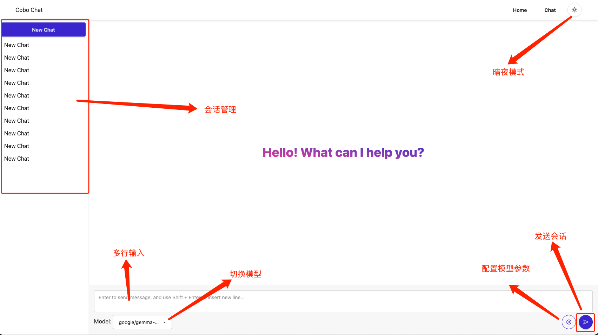
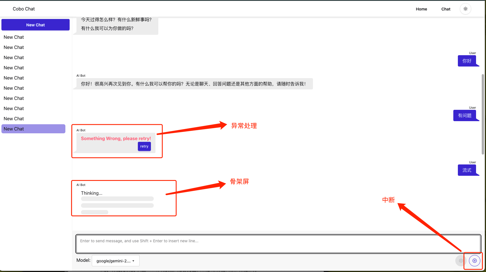
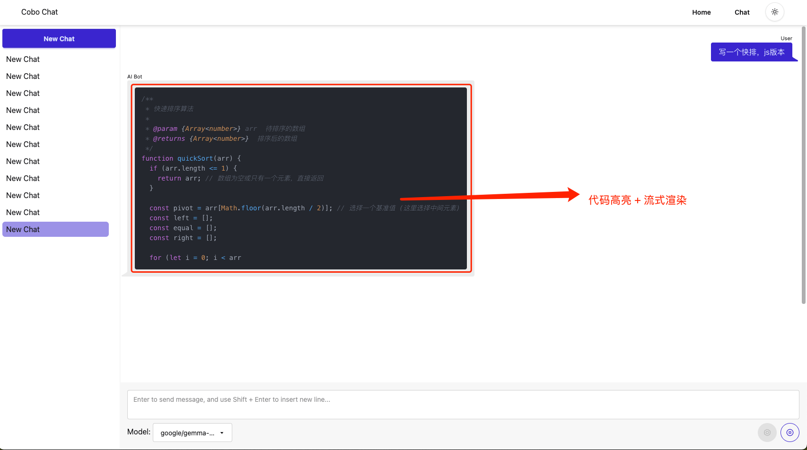
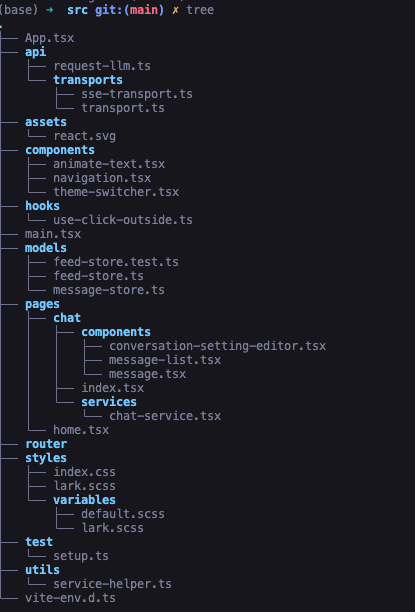

## 纯客户端 Chat 模型

### 功能总览：





### 技术选型：

- **React 19**: -
- **TypeScript**: -
- **Vite**: -
- **ahooks、lodash-es**: 常用 hooks 和 工具。
- **Zustand**: 数据建模比较方便, 使用持久化插件可以快速缓存数据模型到本地存储
- **Tailwind CSS + DaisyUI**: 纯 css 框架，更兼容 tailwind，ui 定制灵活度更高
- **React Router**: 处理页面路由
- **RxJS**: 处理流式更方便，且实现流式平滑化更优雅
- **React Markdown**: 解析和渲染 Markdown 内容
- **React Syntax Highlighter**: Markdown 的代码区域高亮显示

### 架构说明：



* api: 存储项目所有 api 数据交互部分。
  * transports: 主要抽象一个接口，不管底层使用 ws、sse、http、后可以实现与模型的交互。
  * request-llm：初始化 transport。并负责将业务模型转换为 transport 参数，给网络交互，并拿到返回结果。
* assets: -
* components: 全局可复用的组件。
* hooks: 全局可复用的 hook。
* models: 全局领域相关的业务建模。
  * feed-store 负责会话的管理。
  * message-store: 负责消息的管理（WIP 可见注释）
* pages: 页面（页面内的 service 文件可以看做针对视图的 store。和领域逻辑无关
* router: -
* styles: -
* test: -
* utils: -

### 数据模型

feedStore:

```ts
export interface IConversationOptions {
    seed: number, // 请求的 seed
    maxToken: number, // 请求的 maxToken
    model: SupportModels, // 请求的模型
    temperature: number, // 请求的温度
}
export interface IConversation {
    conversationId: string, // 会话的唯一 ID。应该由服务端生成全局唯一ID，此处因为没有服务端，使用 uuid
    converationLabel: string, // 会话标签，后续可以增加会话改名功能，当前使用mock名称
    messages: IMessage[], // 会话消息列表
    options: IConversationOptions, 
}


export interface IFeedStoreState {
    activeConversationId: string // 当前用户访问中的会话
    conversations: Record<ConversationId, IConversation> // 一张大的哈希表，用来记录会话 ID 和 会话信息的关联
}

export interface IFeedStoreActions {
    createConversation(opts?: Partial<IConversationOptions>): string; // 创建一个会话
    sendMessage: (content: string) => (readonly [Promise<unknown>, () => void] | null) // 发送消息（比较核心，底层调用 requestLLM，并用 rxjs 实现平滑化流
    setActiveConversation(conversationId: string): void // 切换会话
    updateConversationOptions(conversationId: string, opts: Partial<IConversationOptions>): void // 更新会话的配置

    // 以下两个方法应该放在 message 的模型。但是时间有限，就放在一起了
    removeAfterMessage(messageId: string): void // 删掉当前活动会话的某个消息后面所有消息
    getMessage(messageId: string): IMessage | undefined; // 获取当前活动会话的某条消息
}

type IFeedStore = IFeedStoreState & IFeedStoreActions

```

messageStore:

```ts

type Role = 'user' | 'assistant'

// message 可以从 feed 中解耦，因为 feed 中使用列表存储message，访问效率很低，且feed本身不应该关注message 内容，只要有一个message的引用就好了。
// 但是现在系统比较简单，时间也比较有限，所以暂时先放在一起。
export interface IMessage {
    // TODO： messageid 先用客户端生成的，正常应该客户端生成localMessageId, 等拿到服务端的reply消息，替换localid为messageId
    // 使用 replyid + messageid。可以保证消息之间顺序一致性。扩展多端同步，消息也不会乱
    messageId: string,
    replyId: string,
    // localMessageId?: string,
    // localReplyId?: string,
    content: string,
    role: Role,
    status: 'finish' | 'loading' | 'failed' | 'generating'
}

```


### 如何新增一个模型

下面的模型列表中加入一个新的模型即可：

```js
export const ALL_SUPPORT_MODEL = [
    'google/gemma-3n-e4b-it:free',
    'openai/gpt-4o',
    'google/gemini-2.5-pro-preview'
] as const

```

### 已知问题

1. 因为需求定义不清。比如是否要支持重新生成创建单消息多回复（产品逻辑上继续扩展会增加复杂度，架构上需要改 feedStore 的模型。当前实现类似于消息改写，重新生成某条消息则清空此消息后面的消息上下文。
2. message-list：时间有限，消息列表没有做懒加载和虚拟列表
3. 主题没有特意定制，使用了 daisyui 的默认主题，可以根据 UI 同学诉求，重新定制。
4. 切会话，流式是否中断？产品逻辑待确认
5. 会话参数配置，可以扩展更多
6. 没有时间兼容移动端响应式

### 未来计划

产品层面：
1. 优化 UI、统一 UI 设计语言。避免因为体验割裂，造成用户流失
2. 打磨体验功能：会话自动命名/改名。优化左侧会话切换框的细节
3. 扩展多端存储、同步能力。能力对齐竞品
4. 优化移动端兼容，扩展用户群体

技术层面：
1. 确认产品细节，根据产品细节，argue 后调整当前业务模型。
2. 优化 message-list: 做虚拟列表，且可以懒加载渲染 N 条最近消息，避免出现性能瓶颈。
3. 多会话可以分批加载，且做一下 LRU 汰换。现在多会话性能有点问题。
4. ...
